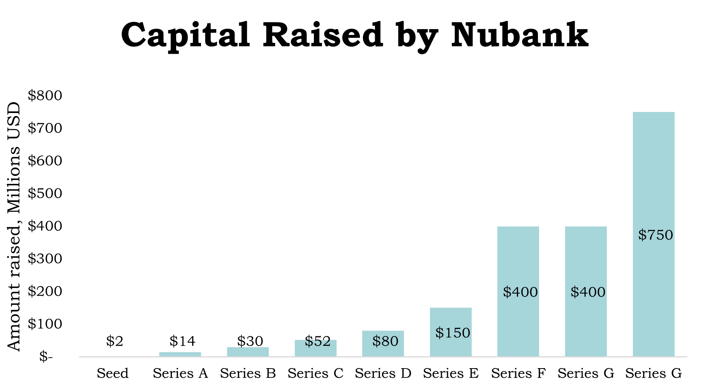

## Why the IPO market is HOT for FinTech in 2021

With news that Nubank, Brazil’s biggest unicorn neobank, is looking to go public via an IPO on the NYSE not long after securing $500m from Warren Buffets Berkshire Hathaway at a $30 billion valuation, the investment enthusiasts among us might be wondering why the IPO market is so hot for FinTech right now.

Initial public offerings (IPO’s) have long been seen as the final hurdle for a company to jump over before crossing the line of corporate success. While IPO’s are traditionally performed by companies wanting to raise extra capital from outside investors, this premature reasoning doesn’t align with why the IPO market is booming for FinTech. With the rise of venture capitalists (VC’s) such as Andreessen Horowitz and Tiger Global, FinTech start-ups are certainly not short of being able to raise large amounts of capital in short periods of time, so why have so many FinTech firms like Robinhood, Affirm and Coinbase gone public? And why are so many more firms like Nubank and Chime thinking about it?

>The markets from New York to Hong Kong were on fire in the first half of this year and have left even the late 90’s dotcom boom era in the rear-view mirror

-- Aaron Arth, Head of the financing group at Goldman Sachs Group Inc. in Asia ex-Japan

Despite an IPO being the most common form of public listing, in recent years there has been a boom in SPAC’s (special Purpose Acquisition Vehicles – think Chamath Palihapitiya with SoFi) as well as direct listings (think Coinbase). So, what are the key reasons for FinTech companies to go public?

1. **Exit Pressure**. With the rise of VCs offering easy funding to tech start-ups during early stages, eventually these active investors will be demanding a ‘real’ return on their investment. Nubank, for example, is looking to IPO with a $50.6 billion valuation by Q4 2021, after receiving a cumulative total of $2.3bn in funding through venture capital firms such as Tiger Global. Without an IPO, these VC investors will not receive any ‘real return’ until they can sell their equity on the secondary markets, hence a key reason why highly funded technology start-ups will ultimately go public. This isn’t the only reason though, and it certainly doesn’t explain why 2021 in particular is so hot.

2. **Valuations**. The common joke among investors is that as long as a company can sell itself as a ‘tech’ stock, the valuation will skyrocket, why? Simply because technology can be quickly scalable with limited overhead costs, hence a higher valuation. A prime example of where this business model tricked investors is WeWork, where the company received a ‘tech’ valuation without being a tech-based company. With Covid-19 producing unprecedented stimulus from governments and low interest rates, tech valuations are currently through the roof due to cheap money and high expectations for future profits, leading to a perfect environment to go public. If anyone is a fan of the ‘All-In’ podcast, one could call this ‘wetting your beak’.

3. **Acceleration from Covid-19**. Finally, the pandemic has increased the adoption of contactless payments, increased online banking, reduced the need for cash payments and increased the need for insurance, hence Lemonades IPO in July 2020. These reasons combined make a perfect situation for financial technology firms to maximise funding and market share by going public in 2020 to 2022.

To further understand how these 3 factors have played a central role in allowing FinTech companies to IPO, let’s take a brief look at Nubank, legally called Nu Pagamentos SA. After being valued at $10 billion in July 2019 from its series F, it more than doubled its valuation in less than 2 years on in the series G, where it received a $25 billion valuation. Its most recent round in July 2021 put it to a $30 billion valuation, 5 months later it is now targeting a $50.6 billion valuation. Below shows the amount of capital raised during each funding round of Nubank. 

If Nubank can achieve an IPO valuation of $50.6 billion, despite still making a net loss in 2020, that would put it among the most valuable companies in the region. With Itau being the incumbent bank, there is no doubt Nubank will soon become the leader and the most valuable company in the region. Now it is clear to see why FinTech firms are licking their lips at the thought of an IPO.

Looking into the future, it is obvious that the FinTech IPO market can’t remain this hot, however, as Chuck Prince famously said, 

>as long as the music is playing, you’ve got to get up and dance

and right now, the music is on full blast. The next big IPO will most likely come from Nubank on the NYSE, shortly followed by Chime and potentially Stripe or Revolut. Nonetheless, these FinTech’s will need to act fast to secure a healthy valuation, as a strengthening global economy from Covid-19 is causing steeper inflation and thus a rising interest rate environment. This environment will only dampen valuations due to a larger discount factor used in the valuation models. By the end of 2022, one can expect a lot of the big FinTech firms to have executed a public listing via IPO, SPAC or Direct listing. The ones who miss the boat will struggle to compete with their competitors’ valuations in the future.

Finally, it is all about execution. With big FinTech players looking at the public markets for funding, the questions being asked will revolve around profitability. Nubank reported an equivalence of $45.5 million loss in 2020, along with public company Stripe reporting a net loss of $165.3 million in Q2 2021. Being able to convince investors of a path to profitability will be key to deciding how valuable the companies are pre-IPO. Most importantly, with Latin America still having a large proportion of the population underbanked, this won’t be too hard for Nubank, especially with the potential entrance into neighbouring markets. We are excited to see these IPO’s unfold in the coming months and years.