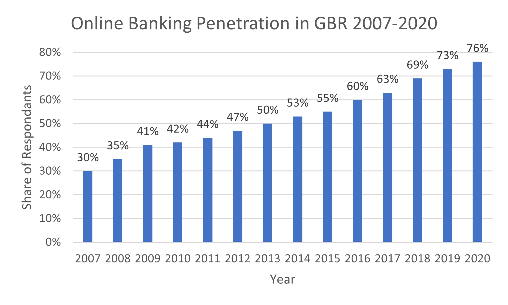

## How Might The Next 10 Years Look?

The world is changing in ways that even the last decade looked like something out of science fiction, and more than that, this change is accelerating. Let’s take the rise of the smartwatch for example, something that only in the noughties was reserved for science fiction has become so ubiquitous that every other John Doe on the tube seems to have one strapped to his wrist. So, with this in mind, let's see what the future of finance might look like:

### A New Banking System

Even within the next decade, we will see huge changes to the way we spend, save and interact with financial institutions. One trend that is likely to continue is the exodus from traditional banks to their quirkier, more modern digital alternatives. Companies such as Monzo, Revolut and Starling have already brought unique value to the banking industry in terms of ease of use, low fees and extra features that many high street stalwarts have been unable to match, in fact, zealous FinTech founder Immad Akhund (2021), who built and runs the SMB fintech platform Mercury, thinks the next five years will see the four largest banks in the U.S. “all be worth less than $100 billion”, ouch!

### A Shift to Open Protocol

It is possible that in the future data and software will be shared more freely between companies, and this trend is already starting. Look at FINOS for example, a company leading the push for open source fintech solutions, it is essentially a source for underlying financial tools for other companies to build on. 

Fintech is following the same pattern of computing in the noughties. At the start of the computing revolution, software and hardware came bundled, then the internet and advancements in technology opened software use through software-as-a-service. It’s not inconceivable that the basic infrastructure will become freely available, inviting more competition and innovation in an already rapidly expanding marketplace. 

### No Code and Low Code Will Redefine Application Creation

No code development platforms will open up the industry to a whole new cohort of entrepreneurs who right now lack the expertise to create complex computational programmes. We have already seen the beginning of this with things such as drag and drop website creators, and this will develop to allow far more complex systems to be created in a similar way. 

Global giants such as Google are already getting in the game, with their recent purchase of Unqork a statement of intent in taking this service seriously. Will growing interest from tech unicorns and fast-improving interfaces, we could see a boom in FinTech offerings from established heritage brands who have so far been able to compete with their new tech rivals, in addition to savvy go-getters who can bring their unique offerings to a global market.

So overall, we can expect the next 10 years to look a little like the last 10, exploding investment, innovation and growing expertise will push the FinTech industry to new heights and provide the sort of opportunities last seen in the boom of the internet in the late 1990s. The financial industry may well see a huge shakeup and the big players are going to have to be ready if they want to keep pace.

-----

### References

1. Akhund, I. (2021). Fintech founder predicts the biggest 4 banks will be worth ‘less than $100 billion’ in 5 years. Fortune. Retrieved from https://fortune.com/2021/12/02/fintech-versus-banks-predictions/.