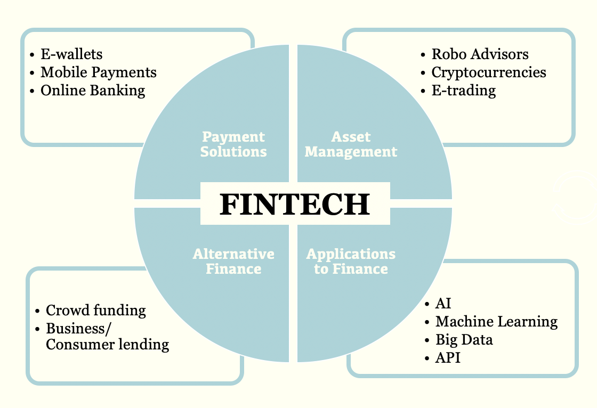

Although you might not have heard the term ‘FinTech’, you are probably using three or four different applications of FinTech (Financial Technology) in your day to day lives. Not convinced? Let me explain how. Do you remember that overpriced Starbucks coffee you paid for with Apple Pay? Financial Technology facilitated that payment. How about when you transferred your friend the money you owe them via online banking? Financial Technology allowed that to happen. Oh, and what about when you opened that Coinbase account to ‘buy the dip’ in cryptocurrencies? That was most definitely only made possible by the huge advancements in Financial Technology.

So, what is FinTech, or as its less commonly called, Financial Technology? In simple terms, it is any technology or software that helps provide financial services more efficiently.

Technology has long been seen as the holy grail for increasing the scalability and speed of any product or business (yes, we agree with this too), therefore, when applying technology to finance, it is clear to see the huge benefits possible to society. Before we delve deeper into the applications, let’s have a brief look at the history of FinTech.

## Brief History of FinTech

Although we now think of cryptocurrencies, neobanks and big data when discussing FinTech, this has not always been the case and it is useful to have a brief understanding of the early days of Financial Technology. 

In 1967, Barclays installed the first ATM. This was the start of banking digitalisation and allowed consumers to withdraw their cash without the bank being open, sounds crazy thinking about that now. There was a slight problem, however, as plastic bank cards had not yet been created. Barclays introduced their first debit card in 1987, other banks followed suit shortly after.

In 1971, NASDAQ, the digital US stock exchange, was launched. This proved pivotal to the financial industry as the [SWIFT system](https://www.investopedia.com/articles/personal-finance/050515/how-swift-system-works.asp) was created, allowing for online cross border transfers of money. Interestingly, Ripple (XRP), the controversial cryptocurrency, is challenging the SWIFT system to become the new transfer system used by banks across the globe, hence it being dubbed the ‘bankers coin’.

In the 1990’s ‘tech boom’, FinTech was growing exponentially. Despite the bubble that burst in the early 2000’s, this era paved its way for some serious FinTech giants. PayPal, founded in 1998, is still a leading payment solution company which lasted the dotcom boom and is thriving today. Also, tech giants like Amazon are fully integrated into the financial system despite being an e-commerce company. 

Post the 2008 financial crash, regulation restricted large banks from expanding and investing too freely, leading way for new, agile start-ups challenging the system. This has now led us to the current day where FinTech companies are flourishing all over the world, with challenger banks like Revolut in Europe, NuBank in Latin America and Ant Financials in Asia rapidly becoming the industry leaders. The scope of this report is to inform you on FinTech, therefore, if you’d like to learn more about these companies and industries, follow us and keep an eye out for our weekly articles.

## FinTech Applications

Finally, to provide a better understanding of the umbrella term ‘FinTech’, we hope the below diagram illustrates it easier. By no means is this list extensive, however, it will offer a good starting point.

As you can see, Financial Technology has many applications to the industry, and there is a growing importance on FinTech to accommodate the demands of consumers. To stay ahead of the curve, we would recommend reading our weekly FinTech articles produced by the analysts! 

  

